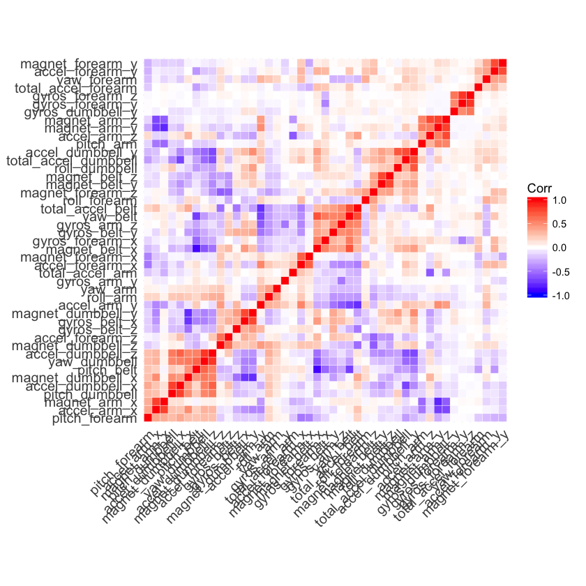
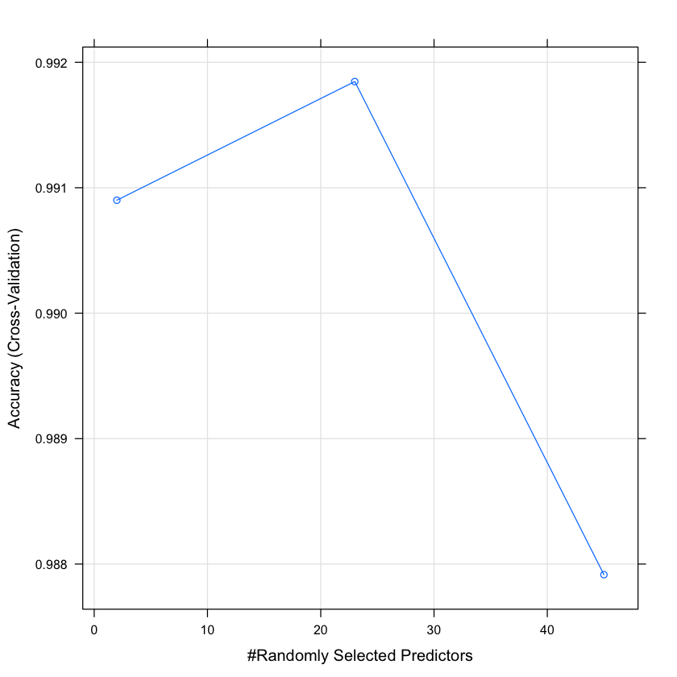
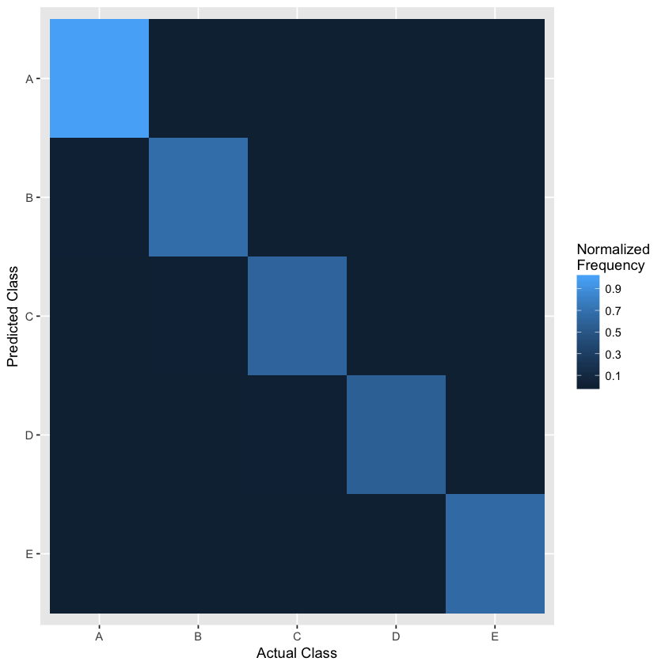
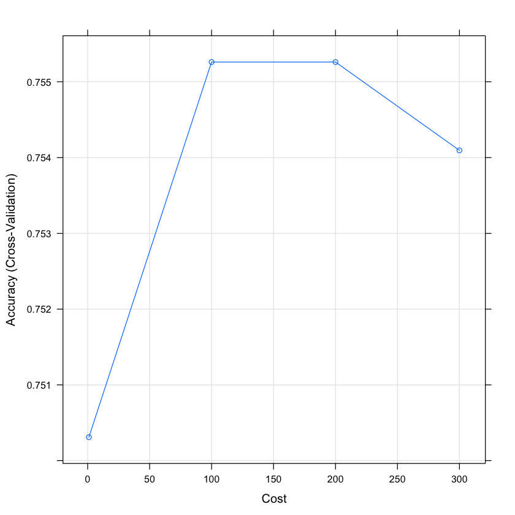
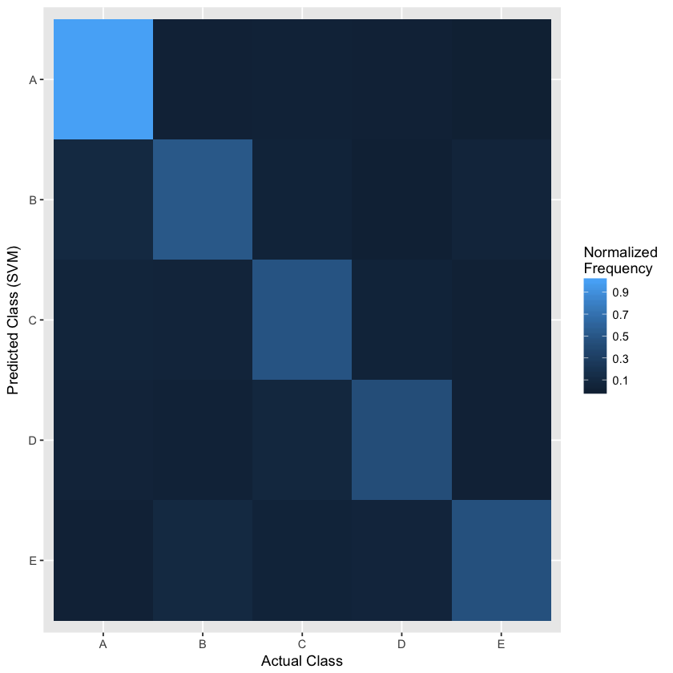

## Background

Using devices such as Jawbone Up, Nike FuelBand, and Fitbit it is now possible to collect a large amount of data about personal activity relatively inexpensively. These type of devices are part of the quantified self movement – a group of enthusiasts who take measurements about themselves regularly to improve their health, to find patterns in their behavior, or because they are tech geeks. One thing that people regularly do is quantify how much of a particular activity they do, but they rarely quantify how well they do it. In this project, your goal will be to use data from accelerometers on the belt, forearm, arm, and dumbell of 6 participants. They were asked to perform barbell lifts correctly and incorrectly in 5 different ways. More information is available from the website here: http://web.archive.org/web/20161224072740/http:/groupware.les.inf.puc-rio.br/har (see the section on the Weight Lifting Exercise Dataset).


```R
library(caret); library(tictoc); library(ggcorrplot)
```

#### Load the data sets


```R
train_raw <- read.csv("pml-training.csv", na.strings=c("NA","#DIV/0!",""))
testing <- read.csv("pml-testing.csv", na.strings=c("NA","#DIV/0!",""))
```


```R
str(train_raw)
```

    'data.frame':	19622 obs. of  160 variables:
     $ X                       : int  1 2 3 4 5 6 7 8 9 10 ...
     $ user_name               : Factor w/ 6 levels "adelmo","carlitos",..: 2 2 2 2 2 2 2 2 2 2 ...
     $ raw_timestamp_part_1    : int  1323084231 1323084231 1323084231 1323084232 1323084232 1323084232 1323084232 1323084232 1323084232 1323084232 ...
     $ raw_timestamp_part_2    : int  788290 808298 820366 120339 196328 304277 368296 440390 484323 484434 ...
     $ cvtd_timestamp          : Factor w/ 20 levels "02/12/2011 13:32",..: 9 9 9 9 9 9 9 9 9 9 ...
     $ new_window              : Factor w/ 2 levels "no","yes": 1 1 1 1 1 1 1 1 1 1 ...
     $ num_window              : int  11 11 11 12 12 12 12 12 12 12 ...
     $ roll_belt               : num  1.41 1.41 1.42 1.48 1.48 1.45 1.42 1.42 1.43 1.45 ...
     $ pitch_belt              : num  8.07 8.07 8.07 8.05 8.07 8.06 8.09 8.13 8.16 8.17 ...
     $ yaw_belt                : num  -94.4 -94.4 -94.4 -94.4 -94.4 -94.4 -94.4 -94.4 -94.4 -94.4 ...
     $ total_accel_belt        : int  3 3 3 3 3 3 3 3 3 3 ...
     $ kurtosis_roll_belt      : num  NA NA NA NA NA NA NA NA NA NA ...
     $ kurtosis_picth_belt     : num  NA NA NA NA NA NA NA NA NA NA ...
     $ kurtosis_yaw_belt       : logi  NA NA NA NA NA NA ...
     $ skewness_roll_belt      : num  NA NA NA NA NA NA NA NA NA NA ...
     $ skewness_roll_belt.1    : num  NA NA NA NA NA NA NA NA NA NA ...
     $ skewness_yaw_belt       : logi  NA NA NA NA NA NA ...
     $ max_roll_belt           : num  NA NA NA NA NA NA NA NA NA NA ...
     $ max_picth_belt          : int  NA NA NA NA NA NA NA NA NA NA ...
     $ max_yaw_belt            : num  NA NA NA NA NA NA NA NA NA NA ...
     $ min_roll_belt           : num  NA NA NA NA NA NA NA NA NA NA ...
     $ min_pitch_belt          : int  NA NA NA NA NA NA NA NA NA NA ...
     $ min_yaw_belt            : num  NA NA NA NA NA NA NA NA NA NA ...
     $ amplitude_roll_belt     : num  NA NA NA NA NA NA NA NA NA NA ...
     $ amplitude_pitch_belt    : int  NA NA NA NA NA NA NA NA NA NA ...
     $ amplitude_yaw_belt      : num  NA NA NA NA NA NA NA NA NA NA ...
     $ var_total_accel_belt    : num  NA NA NA NA NA NA NA NA NA NA ...
     $ avg_roll_belt           : num  NA NA NA NA NA NA NA NA NA NA ...
     $ stddev_roll_belt        : num  NA NA NA NA NA NA NA NA NA NA ...
     $ var_roll_belt           : num  NA NA NA NA NA NA NA NA NA NA ...
     $ avg_pitch_belt          : num  NA NA NA NA NA NA NA NA NA NA ...
     $ stddev_pitch_belt       : num  NA NA NA NA NA NA NA NA NA NA ...
     $ var_pitch_belt          : num  NA NA NA NA NA NA NA NA NA NA ...
     $ avg_yaw_belt            : num  NA NA NA NA NA NA NA NA NA NA ...
     $ stddev_yaw_belt         : num  NA NA NA NA NA NA NA NA NA NA ...
     $ var_yaw_belt            : num  NA NA NA NA NA NA NA NA NA NA ...
     $ gyros_belt_x            : num  0 0.02 0 0.02 0.02 0.02 0.02 0.02 0.02 0.03 ...
     $ gyros_belt_y            : num  0 0 0 0 0.02 0 0 0 0 0 ...
     $ gyros_belt_z            : num  -0.02 -0.02 -0.02 -0.03 -0.02 -0.02 -0.02 -0.02 -0.02 0 ...
     $ accel_belt_x            : int  -21 -22 -20 -22 -21 -21 -22 -22 -20 -21 ...
     $ accel_belt_y            : int  4 4 5 3 2 4 3 4 2 4 ...
     $ accel_belt_z            : int  22 22 23 21 24 21 21 21 24 22 ...
     $ magnet_belt_x           : int  -3 -7 -2 -6 -6 0 -4 -2 1 -3 ...
     $ magnet_belt_y           : int  599 608 600 604 600 603 599 603 602 609 ...
     $ magnet_belt_z           : int  -313 -311 -305 -310 -302 -312 -311 -313 -312 -308 ...
     $ roll_arm                : num  -128 -128 -128 -128 -128 -128 -128 -128 -128 -128 ...
     $ pitch_arm               : num  22.5 22.5 22.5 22.1 22.1 22 21.9 21.8 21.7 21.6 ...
     $ yaw_arm                 : num  -161 -161 -161 -161 -161 -161 -161 -161 -161 -161 ...
     $ total_accel_arm         : int  34 34 34 34 34 34 34 34 34 34 ...
     $ var_accel_arm           : num  NA NA NA NA NA NA NA NA NA NA ...
     $ avg_roll_arm            : num  NA NA NA NA NA NA NA NA NA NA ...
     $ stddev_roll_arm         : num  NA NA NA NA NA NA NA NA NA NA ...
     $ var_roll_arm            : num  NA NA NA NA NA NA NA NA NA NA ...
     $ avg_pitch_arm           : num  NA NA NA NA NA NA NA NA NA NA ...
     $ stddev_pitch_arm        : num  NA NA NA NA NA NA NA NA NA NA ...
     $ var_pitch_arm           : num  NA NA NA NA NA NA NA NA NA NA ...
     $ avg_yaw_arm             : num  NA NA NA NA NA NA NA NA NA NA ...
     $ stddev_yaw_arm          : num  NA NA NA NA NA NA NA NA NA NA ...
     $ var_yaw_arm             : num  NA NA NA NA NA NA NA NA NA NA ...
     $ gyros_arm_x             : num  0 0.02 0.02 0.02 0 0.02 0 0.02 0.02 0.02 ...
     $ gyros_arm_y             : num  0 -0.02 -0.02 -0.03 -0.03 -0.03 -0.03 -0.02 -0.03 -0.03 ...
     $ gyros_arm_z             : num  -0.02 -0.02 -0.02 0.02 0 0 0 0 -0.02 -0.02 ...
     $ accel_arm_x             : int  -288 -290 -289 -289 -289 -289 -289 -289 -288 -288 ...
     $ accel_arm_y             : int  109 110 110 111 111 111 111 111 109 110 ...
     $ accel_arm_z             : int  -123 -125 -126 -123 -123 -122 -125 -124 -122 -124 ...
     $ magnet_arm_x            : int  -368 -369 -368 -372 -374 -369 -373 -372 -369 -376 ...
     $ magnet_arm_y            : int  337 337 344 344 337 342 336 338 341 334 ...
     $ magnet_arm_z            : int  516 513 513 512 506 513 509 510 518 516 ...
     $ kurtosis_roll_arm       : num  NA NA NA NA NA NA NA NA NA NA ...
     $ kurtosis_picth_arm      : num  NA NA NA NA NA NA NA NA NA NA ...
     $ kurtosis_yaw_arm        : num  NA NA NA NA NA NA NA NA NA NA ...
     $ skewness_roll_arm       : num  NA NA NA NA NA NA NA NA NA NA ...
     $ skewness_pitch_arm      : num  NA NA NA NA NA NA NA NA NA NA ...
     $ skewness_yaw_arm        : num  NA NA NA NA NA NA NA NA NA NA ...
     $ max_roll_arm            : num  NA NA NA NA NA NA NA NA NA NA ...
     $ max_picth_arm           : num  NA NA NA NA NA NA NA NA NA NA ...
     $ max_yaw_arm             : int  NA NA NA NA NA NA NA NA NA NA ...
     $ min_roll_arm            : num  NA NA NA NA NA NA NA NA NA NA ...
     $ min_pitch_arm           : num  NA NA NA NA NA NA NA NA NA NA ...
     $ min_yaw_arm             : int  NA NA NA NA NA NA NA NA NA NA ...
     $ amplitude_roll_arm      : num  NA NA NA NA NA NA NA NA NA NA ...
     $ amplitude_pitch_arm     : num  NA NA NA NA NA NA NA NA NA NA ...
     $ amplitude_yaw_arm       : int  NA NA NA NA NA NA NA NA NA NA ...
     $ roll_dumbbell           : num  13.1 13.1 12.9 13.4 13.4 ...
     $ pitch_dumbbell          : num  -70.5 -70.6 -70.3 -70.4 -70.4 ...
     $ yaw_dumbbell            : num  -84.9 -84.7 -85.1 -84.9 -84.9 ...
     $ kurtosis_roll_dumbbell  : num  NA NA NA NA NA NA NA NA NA NA ...
     $ kurtosis_picth_dumbbell : num  NA NA NA NA NA NA NA NA NA NA ...
     $ kurtosis_yaw_dumbbell   : logi  NA NA NA NA NA NA ...
     $ skewness_roll_dumbbell  : num  NA NA NA NA NA NA NA NA NA NA ...
     $ skewness_pitch_dumbbell : num  NA NA NA NA NA NA NA NA NA NA ...
     $ skewness_yaw_dumbbell   : logi  NA NA NA NA NA NA ...
     $ max_roll_dumbbell       : num  NA NA NA NA NA NA NA NA NA NA ...
     $ max_picth_dumbbell      : num  NA NA NA NA NA NA NA NA NA NA ...
     $ max_yaw_dumbbell        : num  NA NA NA NA NA NA NA NA NA NA ...
     $ min_roll_dumbbell       : num  NA NA NA NA NA NA NA NA NA NA ...
     $ min_pitch_dumbbell      : num  NA NA NA NA NA NA NA NA NA NA ...
     $ min_yaw_dumbbell        : num  NA NA NA NA NA NA NA NA NA NA ...
     $ amplitude_roll_dumbbell : num  NA NA NA NA NA NA NA NA NA NA ...
      [list output truncated]


```R
# use the column starting from 'roll_belt' & remove NAs
features <- names(testing[, colSums(is.na(testing)) == 0])[8:59]


train_raw <- train_raw[,c(features,"classe")]
testing <- testing[,c(features,"problem_id")]
```


```R
dim(train_raw); dim(testing)

# check class imbalance 
table(train_raw$classe)
```


<ol class=list-inline>
	<li>19622</li>
	<li>53</li>
</ol>


<ol class=list-inline>
	<li>20</li>
	<li>53</li>
</ol>


    
       A    B    C    D    E 
    5580 3797 3422 3216 3607 


#### Remove columns with NA > 90% and nearZeroVar


```R
# missing values more than 90%
# mv <- lapply(train_raw, function(x) sum(is.na(x)/nrow(train_raw)))
# train_raw <- train_raw[, mv<=0.9]
# testing <- testing[, mv<=0.9]
# train_raw <- train_raw[, colSums(is.na(train_raw)) == 0] 
# testing <- testing[, colSums(is.na(testing)) == 0] 
# dim(train_raw); dim(testing)
```


<ol class=list-inline>
	<li>19622</li>
	<li>53</li>
</ol>


<ol class=list-inline>
	<li>20</li>
	<li>53</li>
</ol>


```R
# nearZeroVar
# nzv <- nearZeroVar(train_raw, freqCut = 95/5)
# print(nzv)
# train_raw <- train_raw[, -nzv]
# testing <- testing[, -nzv]
# dim(train_raw); dim(testing)
```

    integer(0)


#### Remove highly correlated variables (e.g., > 90%)


```R
# find correlations and remove
nums <- sapply(train_raw, is.numeric)
highlyCorDescr <- findCorrelation(cor(train_raw[, nums], use="complete.obs"), cutoff = 0.9)
train_raw <- train_raw[, -highlyCorDescr]
testing <- testing[, -highlyCorDescr]
dim(train_raw); dim(testing)
```


<ol class=list-inline>
	<li>19622</li>
	<li>46</li>
</ol>


<ol class=list-inline>
	<li>20</li>
	<li>46</li>
</ol>


```R
# plot correlation 
nums <- sapply(train_raw, is.numeric)
corr <- round(cor(train_raw[, nums], use = "complete.obs"), 2)
ggcorrplot(corr, hc.order = TRUE, outline.col = "white") 

```





#### Data partition


```R
set.seed(12345)
inTrain <- createDataPartition(y=train_raw$classe, p=0.7, list=FALSE)

training <- train_raw[inTrain, ]
validation <- train_raw[-inTrain, ]
```


```R
# check dimensions again
dflist <- list(train_raw, training, validation, testing)
sapply(dflist, dim)

# check class imbalance 
table(training$classe)
```


<table>
<tbody>
	<tr><td>19622</td><td>13737</td><td>5885 </td><td>20   </td></tr>
	<tr><td>   46</td><td>   46</td><td>  46 </td><td>46   </td></tr>
</tbody>
</table>


    
       A    B    C    D    E 
    3906 2658 2396 2252 2525 


### Modeling & Prediction

#### Classe type: 
- specification (Class A) 
- throwing the elbows to the front (Class B)
- lifting the dumbbell only halfway (Class C)
- lowering the dumbbell only halfway (Class D) 
- throwing the hips to the front (Class E)

#### Try RandomForest model

use 10-fold cross-validation & ntree=100


```R
tic("ModelRF") # calculate time
setting <- trainControl(method="cv", classProbs=TRUE, 
                        savePredictions=TRUE,
                        allowParallel=TRUE, 
                        number = 10)
ModelRF <- train(classe ~ ., data=training, 
                 method="rf", 
                 trControl=setting, 
                 ntree=100)
toc()  # about 7 min
ModelRF
```

    randomForest 4.6-12
    Type rfNews() to see new features/changes/bug fixes.
    
    Attaching package: ‘randomForest’
    
    The following object is masked from ‘package:ggplot2’:
    
        margin
    


    ModelRF: 415.416 sec elapsed


    Random Forest 
    
    13737 samples
       45 predictor
        5 classes: 'A', 'B', 'C', 'D', 'E' 
    
    No pre-processing
    Resampling: Cross-Validated (10 fold) 
    Summary of sample sizes: 12362, 12362, 12364, 12363, 12363, 12363, ... 
    Resampling results across tuning parameters:
    
      mtry  Accuracy   Kappa    
       2    0.9909005  0.9884884
      23    0.9918465  0.9896858
      45    0.9879153  0.9847128
    
    Accuracy was used to select the optimal model using  the largest value.
    The final value used for the model was mtry = 23.


```R
plot(ModelRF)
```





```R
PredRF <- predict(ModelRF, validation)
Accuracy_RF <- confusionMatrix(PredRF, validation$classe)$overall['Accuracy']
```


```R
confusionMatrix(PredRF, validation$classe)
RF_confuse <- as.matrix(confusionMatrix(PredRF, validation$classe))
```


    Confusion Matrix and Statistics
    
              Reference
    Prediction    A    B    C    D    E
             A 1670    9    0    0    0
             B    4 1126    9    0    0
             C    0    4 1012   12    0
             D    0    0    5  952    5
             E    0    0    0    0 1077
    
    Overall Statistics
                                             
                   Accuracy : 0.9918         
                     95% CI : (0.9892, 0.994)
        No Information Rate : 0.2845         
        P-Value [Acc > NIR] : < 2.2e-16      
                                             
                      Kappa : 0.9897         
     Mcnemar's Test P-Value : NA             
    
    Statistics by Class:
    
                         Class: A Class: B Class: C Class: D Class: E
    Sensitivity            0.9976   0.9886   0.9864   0.9876   0.9954
    Specificity            0.9979   0.9973   0.9967   0.9980   1.0000
    Pos Pred Value         0.9946   0.9886   0.9844   0.9896   1.0000
    Neg Pred Value         0.9990   0.9973   0.9971   0.9976   0.9990
    Prevalence             0.2845   0.1935   0.1743   0.1638   0.1839
    Detection Rate         0.2838   0.1913   0.1720   0.1618   0.1830
    Detection Prevalence   0.2853   0.1935   0.1747   0.1635   0.1830
    Balanced Accuracy      0.9977   0.9929   0.9915   0.9928   0.9977


```R
# Plot Confusion Matrix
normalize <- function(m){
     (m - min(m))/(max(m)-min(m))
}

# normalize confusion matrix
input.matrix <- normalize(RF_confuse)


colnames(input.matrix) = c("A", "B", "C", "D", "E")
rownames(input.matrix) = colnames(input.matrix)

confusion <- as.data.frame(as.table(input.matrix))

plot <- ggplot(confusion)
plot + geom_tile(aes(x=Var1, y=Var2, fill=Freq)) + 
    scale_x_discrete(name="Actual Class") + 
    scale_y_discrete(limits = rev(levels(confusion$Var2)) ,name="Predicted Class") + 
    scale_fill_gradient(breaks=seq(from=-.5, to=4, by=.2)) + 
    labs(fill="Normalized\nFrequency") 
```





```R

```

#### Try SVM linear model


```R
# choose C parameter for tuning
grid <- expand.grid(C = c(1, 100, 200, 300))

tic("ModelSVM") # calculate time
setting <- trainControl(method="cv", 5)
ModelSVM <- train(classe ~ ., data=training, 
                              method="svmLinear", 
                              trControl=setting, 
                              preProcess = c("center", "scale"),
                              tuneGrid = grid,
                              tuneLength = 10)
toc()  # about 2.4 hours
ModelSVM
```

    ModelSVM: 8737.403 sec elapsed


    Support Vector Machines with Linear Kernel 
    
    13737 samples
       45 predictor
        5 classes: 'A', 'B', 'C', 'D', 'E' 
    
    Pre-processing: centered (45), scaled (45) 
    Resampling: Cross-Validated (5 fold) 
    Summary of sample sizes: 10990, 10988, 10989, 10991, 10990 
    Resampling results across tuning parameters:
    
      C    Accuracy   Kappa    
        1  0.7503101  0.6822983
      100  0.7552608  0.6886463
      200  0.7552607  0.6886487
      300  0.7540952  0.6871524
    
    Accuracy was used to select the optimal model using  the largest value.
    The final value used for the model was C = 100.


```R
plot(ModelSVM)
```





```R
PredSVM <- predict(ModelSVM, validation)
Accuracy_SVM <- confusionMatrix(PredSVM, validation$classe)$overall['Accuracy']
```


```R
confusionMatrix(PredSVM, validation$classe)
SVM_confuse <- as.matrix(confusionMatrix(PredSVM, validation$classe))
```


    Confusion Matrix and Statistics
    
              Reference
    Prediction    A    B    C    D    E
             A 1533  168   97   77   43
             B   37  791   86   51  166
             C   53   74  739  128   72
             D   39   21   71  665   95
             E   12   85   33   43  706
    
    Overall Statistics
                                              
                   Accuracy : 0.7534          
                     95% CI : (0.7422, 0.7644)
        No Information Rate : 0.2845          
        P-Value [Acc > NIR] : < 2.2e-16       
                                              
                      Kappa : 0.6864          
     Mcnemar's Test P-Value : < 2.2e-16       
    
    Statistics by Class:
    
                         Class: A Class: B Class: C Class: D Class: E
    Sensitivity            0.9158   0.6945   0.7203   0.6898   0.6525
    Specificity            0.9086   0.9284   0.9327   0.9541   0.9640
    Pos Pred Value         0.7993   0.6994   0.6932   0.7464   0.8032
    Neg Pred Value         0.9645   0.9268   0.9404   0.9401   0.9249
    Prevalence             0.2845   0.1935   0.1743   0.1638   0.1839
    Detection Rate         0.2605   0.1344   0.1256   0.1130   0.1200
    Detection Prevalence   0.3259   0.1922   0.1811   0.1514   0.1494
    Balanced Accuracy      0.9122   0.8114   0.8265   0.8220   0.8082


```R
# Plot Confusion Matrix
normalize <- function(m){
     (m - min(m))/(max(m)-min(m))
}

# normalize confusion matrix
input.matrix <- normalize(SVM_confuse)


colnames(input.matrix) = c("A", "B", "C", "D", "E")
rownames(input.matrix) = colnames(input.matrix)

confusion <- as.data.frame(as.table(input.matrix))

plot <- ggplot(confusion)
plot + geom_tile(aes(x=Var1, y=Var2, fill=Freq)) + 
    scale_x_discrete(name="Actual Class") + 
    scale_y_discrete(limits = rev(levels(confusion$Var2)) ,name="Predicted Class (SVM)") + 
    scale_fill_gradient(breaks=seq(from=-.5, to=4, by=.2)) + 
    labs(fill="Normalized\nFrequency") 
```





### Prediction on test set and model comparison


```R
Accuracy_RF ; Accuracy_SVM
```


<strong>Accuracy:</strong> 0.991843670348343


<strong>Accuracy:</strong> 0.753440951571793


The RandomForest model has slightly better accuracy than the SVM model but is comparable. 


```R
PredRF_test <- predict(ModelRF,  testing)
PredSVM_test <- predict(ModelSVM, testing)
```

#### Predict the test set labels from both models


```R
PredRF_test
```


<ol class=list-inline>
	<li>B</li>
	<li>A</li>
	<li>B</li>
	<li>A</li>
	<li>A</li>
	<li>E</li>
	<li>D</li>
	<li>B</li>
	<li>A</li>
	<li>A</li>
	<li>B</li>
	<li>C</li>
	<li>B</li>
	<li>A</li>
	<li>E</li>
	<li>E</li>
	<li>A</li>
	<li>B</li>
	<li>B</li>
	<li>B</li>
</ol>


```R
PredSVM_test
```


<ol class=list-inline>
	<li>C</li>
	<li>A</li>
	<li>B</li>
	<li>C</li>
	<li>A</li>
	<li>C</li>
	<li>D</li>
	<li>A</li>
	<li>A</li>
	<li>A</li>
	<li>C</li>
	<li>A</li>
	<li>B</li>
	<li>A</li>
	<li>E</li>
	<li>E</li>
	<li>A</li>
	<li>B</li>
	<li>B</li>
	<li>B</li>
</ol>


### Conclusion

The RandomForest model has much higher accuracy (0.99 vs. 0.75) than the SVM model and needs less time for modeling (7 min vs. 2.4 hours). Therefore, the RandomForest model is the better choice here.


```R

```
